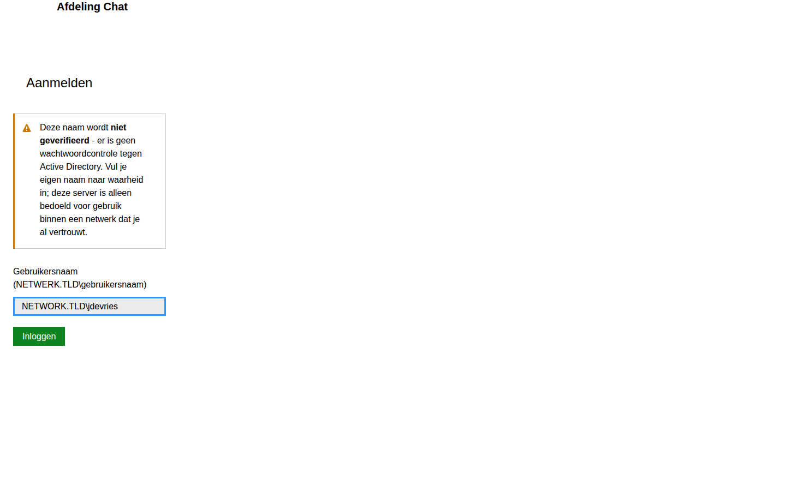
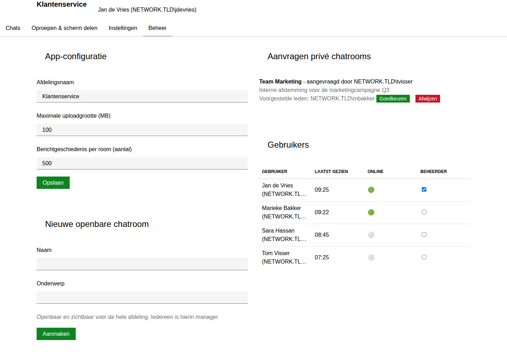
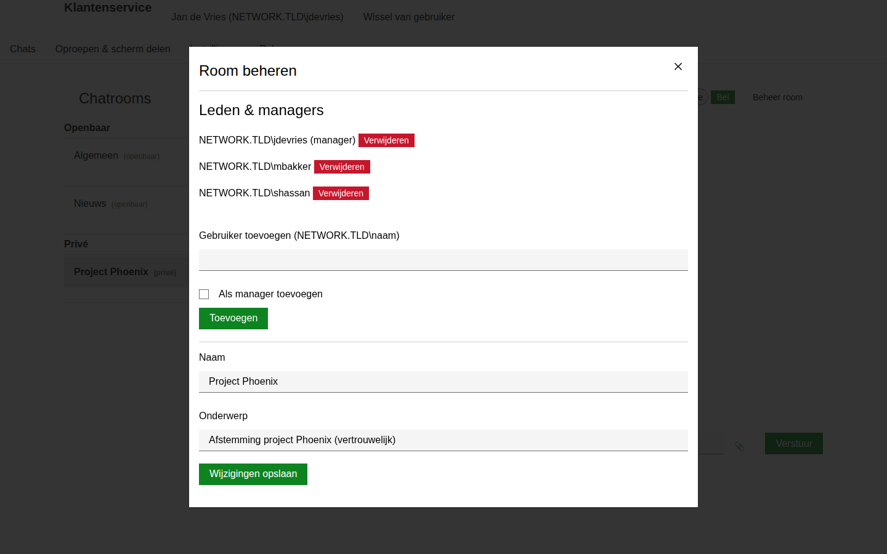

# Beheerdershandleiding - Afdeling Chat

Deze handleiding is voor de beheerder(s) die de chatserver installeren,
inrichten en onderhouden. Voor uitleg over het dagelijks gebruik (chatten,
bellen, bestanden delen), zie de [Gebruikershandleiding](gebruikershandleiding.md).

> De schermafbeeldingen zijn gemaakt met voorbeelddata om alle
> beheerfuncties te kunnen laten zien.

## Inhoud

1. [Hoe de app werkt (kort)](#hoe-de-app-werkt-kort)
2. [Belangrijk: geen echte authenticatie](#belangrijk-geen-echte-authenticatie)
3. [Vereisten](#vereisten)
4. [Installatie](#installatie)
5. [De server starten](#de-server-starten)
6. [Eerste keer inloggen als beheerder](#eerste-keer-inloggen-als-beheerder)
7. [Het tabblad Beheer](#het-tabblad-beheer)
8. [Een privéroom achteraf beheren](#een-priv%C3%A9room-achteraf-beheren)
9. [Onderhoud](#onderhoud)
10. [Problemen oplossen](#problemen-oplossen)
11. [Beveiligingsoverwegingen](#beveiligingsoverwegingen)

## Hoe de app werkt (kort)

- **Eén centrale server** (een PowerShell-script) host alles: de webpagina's,
  de chatgeschiedenis, geüploade bestanden én de live verbindingen. Iedereen
  op de afdeling opent gewoon een browser naar
  `http://<servernaam>:8080/`.
- **Geen beheerdersrechten nodig.** De server draait op een gewone
  `System.Net.Sockets.TcpListener` in plaats van
  `System.Net.HttpListener`, juist omdat die laatste altijd ofwel
  Administrator-rechten ofwel een vooraf door een beheerder geregistreerde
  URL-reservering (`netsh http add urlacl`) vereist - ook voor
  `http://localhost/`. Een gewone TCP-poort openen is op Windows nooit een
  verhoogde actie geweest, dus dat obstakel is er met deze opzet niet.
- **Spraakgesprekken en scherm delen lopen via de server** (een "relay"),
  niet rechtstreeks tussen collega's. Dat is bewust zo gekozen: het werkt
  betrouwbaar binnen het bedrijfsnetwerk zonder extra infrastructuur zoals
  STUN/TURN-servers, met als afweging iets meer vertraging dan bijvoorbeeld
  Teams of Skype.
- **Alles draait op Windows PowerShell 5.1** (standaard aanwezig op
  Windows).

## Belangrijk: geen echte authenticatie

Omdat er geen beheerdersrechten nodig zijn om deze server te draaien, is er
ook geen Integrated Windows Authentication (dat werkt alleen via
`HttpListener`/http.sys). In plaats daarvan typt elke gebruiker zelf zijn
naam of nickname in bij het inloggen (`NETWERK.TLD\gebruikersnaam` of
gewoon `jansen`) - **dit wordt niet
gecontroleerd tegen Active Directory of een wachtwoord.** Wie er toegang
toe heeft, kan zich voordoen als een willekeurige andere gebruiker,
inclusief beheerders (als die naam geraden of bekend is).

Praktisch betekent dit:

- Draai deze server alleen binnen een netwerk/team dat je al vertrouwt -
  niet breed toegankelijk binnen een groot, open bedrijfsnetwerk als daar
  gevoelige gesprekken in privérooms plaatsvinden.
- Zorg voor een wat minder voor-de-hand-liggende poort/hostnaam als je
  extra drempel wilt, al is dat geen echte beveiliging.
- Overweeg bij twijfel de firewallregel (zie [De server starten](#de-server-starten))
  te beperken tot een specifiek subnet in plaats van de hele
  bedrijfsomgeving.

## Vereisten

- Een Windows-server of -pc met **Windows PowerShell 5.1**
  (controleer met `$PSVersionTable.PSVersion` in PowerShell).
- **Geen beheerdersrechten nodig** - een gewoon gebruikersaccount volstaat
  om de server te starten.
- Bij de gebruikers: Chrome of Edge (voor scherm delen, microfoon en de
  moderne webtechnieken die de app gebruikt).

## Installatie

1. Kopieer de volledige projectmap (met de mappen `server/`, `wwwroot/`,
   `data/` en `uploads/`) naar de servermachine, bijvoorbeeld naar
   `D:\AfdelingChat\`.
2. Open `server\config\server.config.json` in een teksteditor en vul in elk
   geval `initialAdmins` in met jouw eigen account, zodat je meteen na de
   eerste start bij het Beheer-tabblad kunt:

   ```json
   {
     "departmentName": "Afdeling Chat",
     "port": 8080,
     "dataDir": "..\\data",
     "uploadsDir": "..\\uploads",
     "wwwrootDir": "..\\wwwroot",
     "maxUploadSizeMb": 100,
     "messageHistoryLimit": 500,
     "screenFrameMaxBytes": 400000,
     "audioChunkMaxBytes": 200000,
     "initialAdmins": [
       "NETWERK.TLD\\jouw-gebruikersnaam"
     ]
   }
   ```

   - `port`: op welke poort de server luistert. Pas dit aan als poort 8080
     al in gebruik is.
   - `initialAdmins`: één of meer accounts die vanaf de allereerste start
     beheerder zijn. Later kun je via het Beheer-tabblad ook andere
     collega's tot beheerder promoveren (zie verderop) - die hoeven dan niet
     in dit bestand te staan. Let op: dit is puur een naam die het systeem
     vertrouwt als beheerder zodra iemand ermee inlogt (zie de
     [waarschuwing hierboven](#belangrijk-geen-echte-authenticatie)) - er
     wordt niet gecontroleerd of degene die inlogt ook echt die persoon is.
   - `departmentName`, `maxUploadSizeMb` en `messageHistoryLimit` zijn de
     startwaarden; je kunt ze later ook via het Beheer-tabblad aanpassen
     zonder de server opnieuw te starten.

3. Laat `dataDir`, `uploadsDir` en `wwwrootDir` staan zoals ze zijn, tenzij
   je bewust een andere mapstructuur wilt. Deze mappen worden bij de eerste
   start automatisch aangemaakt/gevuld.

## De server starten

Open een heel gewoon (niet-verhoogd) PowerShell-venster en start het
opstartscript:

```powershell
cd D:\AfdelingChat\server
.\Start-ChatServer.ps1
```

Je ziet dan zoiets als:

```
=== Afdeling Chat - chatserver gestart ===
Luistert op: http://0.0.0.0:8080/ (geen Administrator-rechten nodig)
wwwroot:     D:\AfdelingChat\wwwroot
data:        D:\AfdelingChat\data
uploads:     D:\AfdelingChat\uploads

Let op: gebruikers loggen in door zelf hun NETWERK.TLD\gebruikersnaam
in te typen - dit wordt niet tegen Active Directory geverifieerd. Draai
deze server alleen binnen een netwerk dat je al vertrouwt.

Druk op Ctrl+C om te stoppen.
```

Laat dit venster openstaan (of richt de server later in als Windows-dienst /
geplande taak die bij het opstarten van de server automatisch draait - dat
valt buiten deze handleiding, maar elk hulpmiddel dat een PowerShell-script
continu kan laten draaien werkt hiervoor, zoals NSSM of Taakplanner met
"Opnieuw uitvoeren bij falen"). Geen van die opties vereist dat het script
zelf als Administrator draait.

### Bereikbaar maken voor collega's op andere machines

Standaard is de server voor iedereen op het netwerk bereikbaar zodra ze het
juiste adres weten, maar de Windows Firewall blokkeert inkomend verkeer op
de gebruikte poort meestal totdat je daar een regel voor toevoegt. Dat ene
firewall-commando vereist wel adminrechten - vraag dit desnoods eenmalig
aan IT, het is een firewallregel en géén http.sys-poortreservering:

```powershell
New-NetFirewallRule -DisplayName "Afdeling Chat" -Direction Inbound -Protocol TCP -LocalPort 8080 -Action Allow
```

Zonder deze regel werkt de server nog steeds voor jezelf via
`http://localhost:8080/`.

### HTTPS (optioneel)

Deze server draait over gewone HTTP. Omdat er (bewust, zie hierboven) geen
`HttpListener` meer gebruikt wordt, is de eerder gebruikelijke
`netsh http add sslcert`-route niet meer van toepassing. Wil je toch TLS,
dan is dat op dit moment niet ingebouwd - overweeg in dat geval een
reverse proxy (bijvoorbeeld IIS of nginx) die zelf HTTPS afhandelt en
doorstuurt naar deze server op `http://localhost:8080/`.

## Eerste keer inloggen als beheerder

Open op je eigen werkplek `http://<servernaam>:8080/` in Chrome of Edge en
vul je eigen account (uit `initialAdmins`) in bij het inlogscherm:



Sta je in `initialAdmins`, dan zie je meteen een extra tabblad **Beheer**
naast Chats, Oproepen & scherm delen en Instellingen.

## Het tabblad Beheer

Dit is het hart van het beheer: app-configuratie, een nieuwe openbare room
aanmaken, aanvragen voor privérooms afhandelen en gebruikers beheren staan
allemaal op één pagina.



### App-configuratie

Links bovenaan pas je de instellingen aan die voor de hele afdeling gelden:

- **Afdelingsnaam** - verschijnt linksboven in de navigatiebalk en als
  paginatitel.
- **Maximale uploadgrootte (MB)** - de bovengrens voor bestanden die
  gebruikers delen in de chat.
- **Berichtgeschiedenis per room (aantal)** - hoeveel berichten per
  chatroom bewaard blijven; oudere berichten worden automatisch
  opgeruimd zodra dit aantal wordt overschreden.

Klik op **Opslaan** om de wijzigingen meteen door te voeren.

### Een nieuwe openbare chatroom aanmaken

Onder **Nieuwe openbare chatroom** vul je een naam en optioneel een
onderwerp in en klik je op **Aanmaken**. De room is direct zichtbaar voor
iedereen op de afdeling, en - zoals bij openbare rooms hoort - is elke
gebruiker die erin chat automatisch ook manager (mag naam/onderwerp
aanpassen).

### Aanvragen voor privérooms afhandelen

Rechtsboven zie je openstaande aanvragen voor privérooms, met wie de
aanvraag heeft ingediend, het opgegeven doel en de voorgestelde leden:

- **Goedkeuren** maakt de room daadwerkelijk aan. De aanvrager wordt
  standaard manager en de voorgestelde leden worden lid. (Wil je een andere
  verdeling van managers/leden, dan kun je dat na het aanmaken direct
  aanpassen via ["Een privéroom beheren"](#een-priv%C3%A9room-achteraf-beheren).)
- **Afwijzen** verwerpt de aanvraag; er wordt geen room aangemaakt.

### Gebruikers beheren

Onderaan rechts staat een overzicht van alle gebruikers die ooit hebben
ingelogd, met hun laatst geziene tijdstip, of ze op dit moment online zijn,
en een selectievakje **Beheerder**. Vink dit aan om iemand beheerdersrechten
te geven, of uit om ze weer in te trekken.

> Gebruikers die nog nooit hebben ingelogd, staan hier nog niet tussen - de
> lijst vult zich vanzelf zodra iemand voor het eerst de app opent. En
> omdat inloggen ongeverifieerd is (zie de waarschuwing bovenaan), betekent
> promoveren tot beheerder hier vooral: "vertrouw iedereen die met deze
> naam inlogt" - controleer dus buiten de app om wie welke naam gebruikt.

## Een privéroom achteraf beheren

Managers van een privéroom (waaronder beheerders, altijd) kunnen leden en
managers aanpassen via **Beheer room** boven de berichten van die room op
het tabblad **Chats**.



- Voeg een gebruiker toe met het volledige `NETWERK.TLD\gebruikersnaam`
  formaat, en vink **Als manager toevoegen** aan als die persoon ook zelf
  leden moet kunnen beheren.
- Klik op **Verwijderen** naast een naam om iemand uit de room te
  verwijderen (dit verwijdert ook het managerschap, mocht die persoon
  manager zijn).
- Onderaan kun je de naam en het onderwerp van de room wijzigen.

Een openbare room verwijderen of een privéroom volledig opheffen kan
(vooralsnog) alleen via de API door een beheerder, niet via een knop in de
interface.

## Onderhoud

- **Data**: chatrooms, berichten, gebruikersinstellingen en bestandsmeta­data
  staan als JSON-bestanden in de map `data/` (en per room onder
  `data/messages/`). Geüploade bestanden zelf staan in `uploads/<roomId>/`.
  Neem deze twee mappen mee in je back-upstrategie.
- **Herstarten**: de server mag gewoon herstart worden (bijvoorbeeld na een
  configuratiewijziging in `server.config.json`, die alleen bij het
  opstarten wordt ingelezen). Actieve gesprekken/verbindingen worden dan
  verbroken, maar chatgeschiedenis en instellingen blijven bewaard. Let op:
  ook de "wie is ingelogd"-cookies blijven bij gebruikers geldig na een
  herstart (er is geen serverstatus voor sessies), dus niemand hoeft
  opnieuw in te loggen.
- **Updates**: vervang de bestanden in `server/` en `wwwroot/` door een
  nieuwere versie en herstart de server. De map `data/` en `uploads/` hoef
  je niet aan te raken.

## Problemen oplossen

**De server start niet / "Kon niet luisteren op poort ...".**
Meestal is de poort al in gebruik door een ander programma. Kies een andere
poort in `server.config.json` (`port`) en probeer opnieuw. In tegenstelling
tot de oudere, op `HttpListener` gebaseerde opzet is hiervoor nooit
verhoogde toegang nodig.

**Gebruikers krijgen een foutmelding bij het inloggen.**
Controleer of het veld niet leeg is gebleven en niet meer dan één backslash
bevat - zowel `NETWERK.TLD\gebruikersnaam` als een korte nickname (bv.
`jansen`) zijn geldig. Blijft het mislukken, controleer of de servermachine
daadwerkelijk bereikbaar is vanaf hun werkplek (poort open in de firewall,
zie [De server starten](#de-server-starten)).

**Chatberichten of oproepen komen niet aan / blijven "verbinden".**
Controleer of er geen firewall of proxy tussen gebruikers en de server in
zit die WebSocket-verkeer (`ws://.../ws`) blokkeert. Reguliere paginabezoeken
(HTTP) kunnen dan nog wel werken, terwijl live chat/bellen uitvalt.

**Een upload mislukt met "Bestand is groter dan de limiet".**
Verhoog zo nodig `maxUploadSizeMb` bij [App-configuratie](#app-configuratie).

## Beveiligingsoverwegingen

- **Geen echte authenticatie** - dit is de belangrijkste afweging van deze
  opzet. Zie [de waarschuwing hierboven](#belangrijk-geen-echte-authenticatie).
  Iedereen die de server kan bereiken en een geldige naamnotatie invult,
  komt erin - als een andere gebruiker, desnoods als beheerder.
- Toegang tot de app is verder zo veilig als de toegang tot je netwerk
  zelf. Zorg dat de server niet bereikbaar is vanaf buiten het vertrouwde
  netwerk zonder aanvullende maatregelen (VPN, firewallregels beperkt tot
  een subnet).
- Standaard loopt al het verkeer over gewone HTTP, onversleuteld; overweeg
  een reverse proxy met TLS (zie [HTTPS](#https-optioneel)) als
  vertrouwelijkheid van het netwerkverkeer zelf een vereiste is.
- Beheerdersrechten in de app (het Beheer-tabblad) zijn onafhankelijk van
  Windows-beheerdersrechten - het gaat puur om wie in `initialAdmins` staat
  of later via de Gebruikers-tabel is gepromoveerd, gecombineerd met het
  feit dat inlognamen niet worden geverifieerd.
