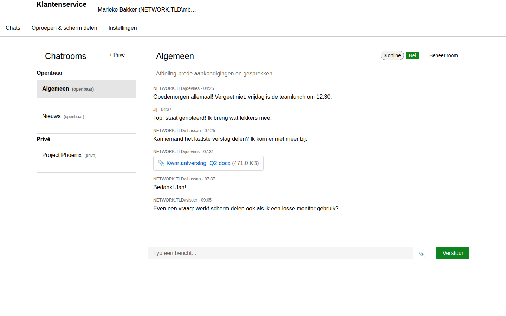
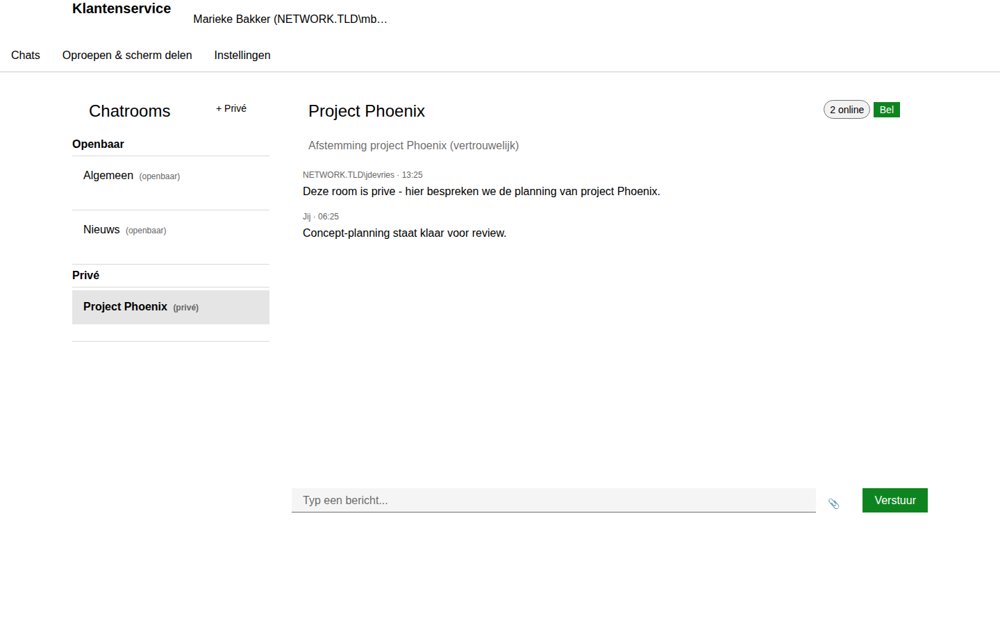
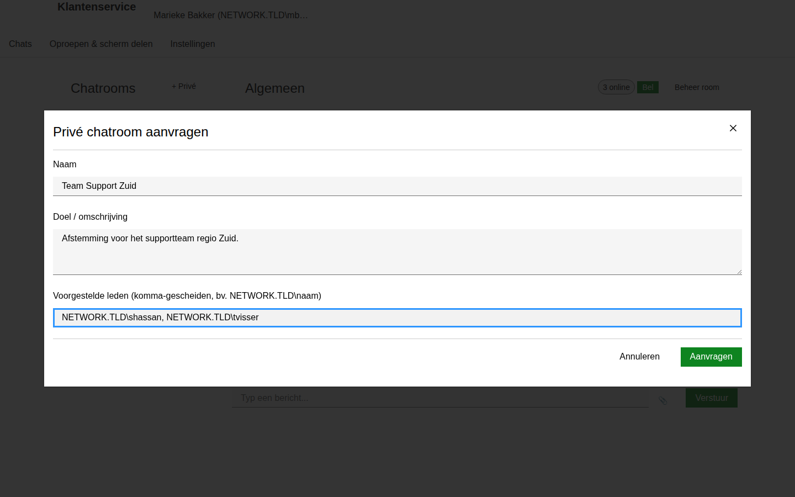
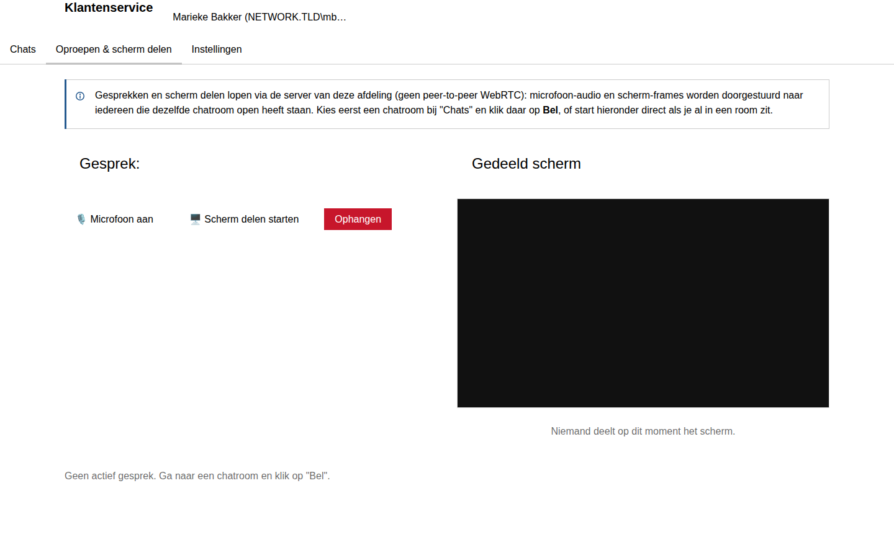
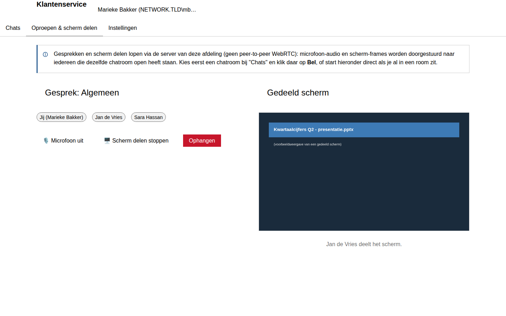
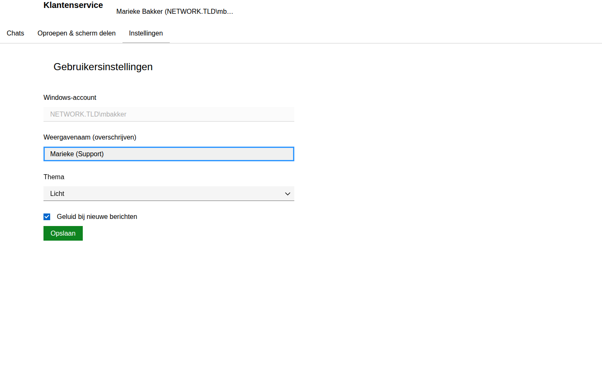
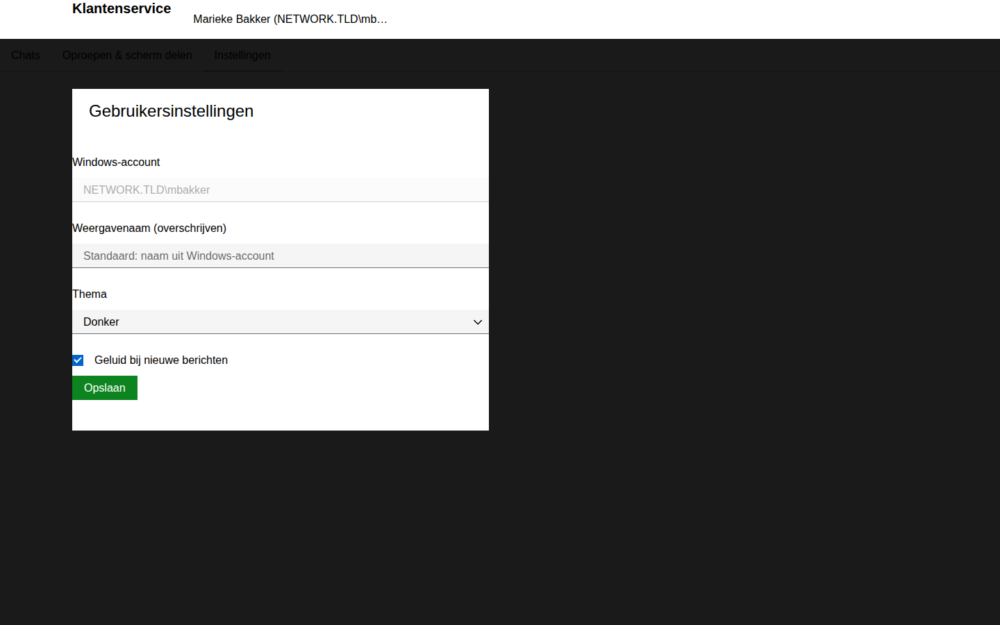

# Gebruikershandleiding - Afdeling Chat

Deze handleiding is voor iedereen die de afdelingschat gebruikt om te chatten,
bestanden te delen, te bellen en het scherm te delen. Ben je beheerder? Kijk
dan ook in de [Beheerdershandleiding](beheerdershandleiding.md).

> De schermafbeeldingen in deze handleiding zijn gemaakt met voorbeelddata
> (namen, rooms en berichten) om alle functies goed te kunnen laten zien. Bij
> jouw afdeling zie je uiteraard de echte chatrooms en collega's.

## Inhoud

1. [Inloggen](#inloggen)
2. [De vier tabbladen](#de-vier-tabbladen)
3. [Chatten](#chatten)
4. [Bestanden delen](#bestanden-delen)
5. [Een privé chatroom aanvragen](#een-priv%C3%A9-chatroom-aanvragen)
6. [Bellen en scherm delen](#bellen-en-scherm-delen)
7. [Instellingen](#instellingen)
8. [Veelgestelde vragen](#veelgestelde-vragen)

## Inloggen

Je hoeft nergens een gebruikersnaam of wachtwoord in te typen. Zodra je de
pagina opent, herkent de server automatisch je huidige Windows-sessie
(`NETWERK.TLD\gebruikersnaam`) en log je vanzelf in.

Als het inloggen langer duurt dan een paar seconden of mislukt, zie je een
foutmelding. Kijk dan bij de [veelgestelde vragen](#veelgestelde-vragen)
hieronder of neem contact op met je beheerder.

## De vier tabbladen

Bovenin de app zie je maximaal vier tabbladen:

| Tabblad | Waarvoor |
|---|---|
| **Chats** | Chatrooms, berichten, bestanden delen |
| **Oproepen & scherm delen** | Spraakgesprekken en scherm delen |
| **Instellingen** | Je eigen weergavenaam, thema en meldingen |
| **Beheer** | Alleen zichtbaar voor beheerders |

## Chatten

Op het tabblad **Chats** zie je links de lijst met chatrooms, verdeeld in
**Openbaar** (zichtbaar voor de hele afdeling) en **Privé** (alleen voor
leden). Klik op een room om de berichten te zien en mee te doen.

- Typ je bericht onderin en druk op **Enter** of klik op **Verstuur**.
- Rechtsboven zie je hoeveel collega's op dit moment in deze room online zijn.
- Terwijl iemand typt, verschijnt daar kort een "... is aan het typen"-melding.
- Nieuwe berichten van anderen laten (indien ingeschakeld bij je
  [instellingen](#instellingen)) een kort geluidje horen.

### Openbare rooms

Openbare chatrooms zijn zichtbaar voor de hele afdeling. Iedereen die erin
zit is automatisch ook **manager**: je mag dus zelf de naam of het onderwerp
aanpassen via de knop **Beheer room**.

### Privérooms

Privérooms zijn alleen zichtbaar voor de leden die zijn toegevoegd. Ben je
gewoon lid, dan zie je geen **Beheer room**-knop:

Ben je wel manager van een privéroom (bijvoorbeeld omdat je hem hebt
aangevraagd), dan kun je via **Beheer room** leden toevoegen of verwijderen
en aangeven wie manager is. Zie de schermafbeelding bij
["Een privéroom beheren"](beheerdershandleiding.md#een-priv%C3%A9room-achteraf-beheren)
in de beheerdershandleiding - dat scherm werkt voor gewone gebruikers
precies hetzelfde als voor beheerders, zolang je zelf manager van die room
bent.

## Bestanden delen

Klik in de berichtenbalk op het paperclip-icoon (📎) naast het invoerveld en
kies een bestand. Het bestand wordt geüpload naar de geselecteerde room en
verschijnt als bericht met bestandsnaam en grootte, zoals hierboven bij
"Kwartaalverslag_Q2.docx" te zien is. Klik op de bestandsnaam om het te
downloaden.

> Er geldt een maximale bestandsgrootte, ingesteld door je beheerder
> (standaard 100 MB). Is een bestand te groot, dan krijg je een foutmelding.

## Een privé chatroom aanvragen

Wil je een eigen, afgeschermde chatroom voor bijvoorbeeld een project of
team? Klik bij **Chatrooms** op **+ Privé**.

Vul een naam, een korte omschrijving en eventueel alvast een paar
voorgestelde leden in (met hun volledige `NETWERK.TLD\gebruikersnaam`,
komma-gescheiden). Klik op **Aanvragen**.

Je aanvraag gaat naar de beheerder(s), die de room aanmaakt en daarbij de
definitieve leden en managers instelt (meestal ben jij dat zelf, als
aanvrager). Zodra de aanvraag is goedgekeurd, verschijnt de room automatisch
in jouw lijst onder **Privé**.

## Bellen en scherm delen

Ga naar een chatroom en klik rechtsboven op **Bel** om een gesprek in die
room te starten (of eraan deel te nemen als een collega al gebeld heeft -
iedereen die in dezelfde room belt, komt automatisch in hetzelfde gesprek
terecht). Je springt dan naar het tabblad **Oproepen & scherm delen**.

Eenmaal in een gesprek:

- **🎙️ Microfoon aan/uit** - schakelt je microfoon in of uit. De browser
  vraagt de eerste keer om toestemming voor microfoongebruik.
- **🖥️ Scherm delen starten/stoppen** - kies welk scherm, venster of
  programma je wilt delen. Andere deelnemers zien het meteen rechts in
  beeld.
- **Ophangen** - verlaat het gesprek.

> **Let op:** gesprekken en scherm delen lopen via de server van je
> afdeling, niet rechtstreeks tussen collega's (peer-to-peer). Dat betekent
> dat het prima werkt voor gewone spraakgesprekken en het delen van een
> scherm of programma binnen het bedrijfsnetwerk, maar met iets meer
> vertraging dan bijvoorbeeld Teams of Skype. Voor grote groepen of
> veeleisend videogebruik is het niet bedoeld.

## Instellingen

Op het tabblad **Instellingen** pas je je eigen voorkeuren aan:

- **Weergavenaam overschrijven** - laat leeg om de naam uit je
  Windows-account te gebruiken, of vul een andere naam in die collega's dan
  zien in de chat.
- **Thema** - kies Licht of Donker.
- **Geluid bij nieuwe berichten** - schakel het meldingsgeluid uit als je
  daar geen behoefte aan hebt.

Klik op **Opslaan**. Het donkere thema ziet er zo uit:

## Veelgestelde vragen

**Ik zie alleen "Bezig met aanmelden..." en kom niet verder.**
Controleer of je de pagina opent in Chrome of Edge, binnen het
bedrijfsnetwerk, en dat je bent ingelogd op een domeincomputer. Lukt het na
een herlaad nog steeds niet, neem dan contact op met je beheerder - mogelijk
moet Integrated Windows Authentication nog worden gecontroleerd (zie de
beheerdershandleiding).

**Kan ik zelf een openbare chatroom aanmaken?**
Nee, openbare (afdelingsbrede) rooms maakt alleen een beheerder aan. Wil je
een eigen afgeschermde ruimte, vraag dan een [privéroom](#een-priv%C3%A9-chatroom-aanvragen)
aan.

**Waarom zie ik geen "Beheer room"-knop bij een privéroom?**
Die knop is alleen zichtbaar voor de managers van die specifieke room. Vraag
een manager van de room (of je beheerder) om je toe te voegen als manager
als je die rechten nodig hebt.

**Mijn microfoon/scherm delen werkt niet.**
Controleer of je browser toestemming heeft gekregen voor microfoon en/of
scherm delen (meestal een pop-up rechtsboven in de adresbalk). Scherm delen
vereist een recente versie van Chrome of Edge.
